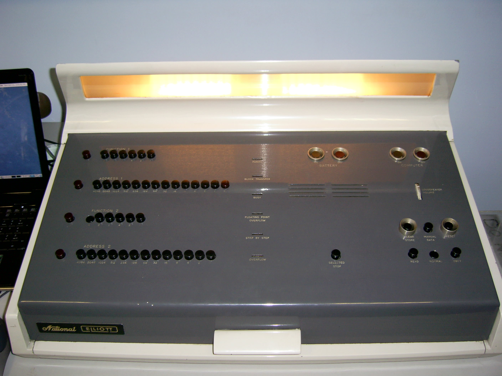

# Elliott 803B Web Emulator

⚡ **TL;DR: How to Run the Emulator in 30 Seconds**
* **First, [watch this quick demo video](https://youtu.be/N4QwmP84HdU)** to see how easy it is to use!*
1. **Download or clone** this repository.
2. Open `index.html` in **Chrome** or **Edge** (*Firefox causes problems*).
3. **Zoom Out:** The emulator was built on a 4K display. Press `"Ctrl" + "-"` to fit it on 1080p or lower resolution screens. 
4. **Full Screen:** Hit **F11** for an immersive experience.
5. **Fresh Start:** Press **Ctrl+F5** (or click the ↻ icon) between historical programs to instantly clear the memory.
6. **Learn by Doing:** The emulator features built-in, step-by-step guides that take you by the hand for direct, interactive learning.

---

## Detailed Instructions & Context

### How to run the emulator (The easiest way)

1. **Download or clone** this repository to your local machine.
2. Open the downloaded folder.
3. Simply double-click on the `index.html` file to open it in any modern web browser. 

*Note: You do not need to install anything or run any command line tools. The emulator is built with standard web technologies (HTML, JS, and CSS) and runs entirely within your browser.*

**Browser Compatibility:** The emulator runs smoothly in **Chrome** or **Edge**. Please note that **Firefox causes problems** (some features like the "ALGOL Mode" shortcut do not work). Additionally, it has not been tested on macOS or Safari.

🌟 **Display & Zooming:** 
The emulator was developed on a 4K display, and even Full HD (1080p) displays require some zooming out. **To fit everything on the screen, it may be necessary to do a "zoom out" ("Ctrl" + "-" on Windows computers).**

🔄 **A Clean Slate for Every Program:** 
If you want to run several historical programs one after the other, **the absolute easiest way to reset the machine is simply to refresh your browser page!** For Chrome and Edge, that means hitting the **Ctrl+F5** key on the PC keyboard, or clicking on the refresh icon (↻) near the address bar. A quick refresh instantly clears the memory and guarantees the emulator starts from a completely clean slate, ready for your next adventure.

🖥️ **Full Screen Mode:**
You may want the emulator to run at full screen: in Chrome and Edge, that is achieved by pressing **F11** (and then **F11** again to return from full screen mode).

### 🎬 See It In Action & Built-in Guides

Step back into the 1960s—without the steep learning curve! 

**[📽️ Watch this quick demo video](https://youtu.be/N4QwmP84HdU)** to see firsthand what the emulator can (and cannot yet) do, and discover just how approachable early computing can be. 

Operating a vintage mainframe might look intimidating, but **it is incredibly easy**. Our built-in, interactive **guides** literally pinpoint every single button you need to press. They hold your hand through the authentic operating procedures, empowering you to confidently run historical marvels—like Tony Hoare's original quicksort, plotter demonstrations, and vintage music programs—entirely on your own. 

Dive in and bring computing history to life!

### ALGOL Compiler Mode

To streamline the experience of testing ALGOL programs, the emulator features an **"ALGOL Mode"** shortcut. Recognising that the historical procedure for loading the compiler involved reading two separate lengthy paper tapes, this shortcut bypasses that arduous process.

With a single click within the interface, the full ALGOL compiler is loaded into the emulator's memory instantaneously. This convenience allows you to immediately begin running and experimenting with the provided ALGOL 60 programs without the requisite loading time of the original hardware.

**Important:** Please ensure you select "ALGOL Mode" *before* attempting to load or run any of the ALGOL programs, as they require the compiler to be present in memory to function correctly.

---

## The Elliott 803B: a machine from the moment computing became practical

The Elliott 803B was not born in the age of sleek screens, silent chips, or consumer electronics. It belongs to an earlier and sterner chapter in the history of computing: the early 1960s, when a computer was a room-scale instrument of science, engineering, and disciplined thought. Built by **Elliott Brothers**, the 803 became one of the most successful British computers of its time, with well over 200 delivered, and it helped carry computing from specialist experimentation into everyday academic and technical use.[^1][^2]

This was a **transistorised, second-generation computer**, loaded by paper tape and operated from a physical console of switches, lamps, and procedures that demanded patience and precision.[^3] 

Its importance was not glamour but usefulness. Machines like the Elliott 803B were where programmers, engineers, and scientists learned not only how to run programs, but how to think computationally.

## Tony Hoare, ALGOL 60, and quicksort

The story of the Elliott family of computers is inseparable from the history of programming itself. **Sir Tony Hoare** — later the recipient of the **1980 A.M. Turing Award**, the highest distinction in computer science — was closely connected with Elliott's ALGOL work.[^4][^5] Hoare is remembered for several major achievements: the invention of **quicksort**, the development of **Hoare logic** for reasoning about program correctness, and later the creation of **Communicating Sequential Processes (CSP)**, a foundational model for concurrent systems.[^5][^6]

The precise archival record is slightly nuanced. ACM's Turing Award biography emphasises Hoare's leadership on the **ALGOL 60 compiler for the Elliott 503**, while Elliott-803-specific historical material credits him with much of the implementation effort behind the **Elliott 803 ALGOL compiler**.[^4][^7] What is clear is that Hoare was central to Elliott's adoption of ALGOL 60, and that this decision mattered.

That mattered because **ALGOL 60** was not just another language. It helped define the modern style of programming: block structure, lexical scope, a disciplined syntax, and a way of expressing algorithms with unusual clarity.[^8][^9] In that world, Hoare's **quicksort** was more than a fast sorting method. It became one of the enduring examples of algorithmic elegance — a compact, powerful idea whose clarity matched the language that helped express it.[^6][^10]

So the Elliott 803B matters not only as hardware, but as part of the historical moment when **computer architecture, programming languages, and algorithm design** began to reinforce one another in ways that still shape computing today.

## A Portuguese connection

The Elliott story also has a very real place in the history of computing in **Portugal**.

Portuguese sources identify the **National Elliott 803-B installed at Banco Pinto de Magalhães** as the **first computer installed in Portugal**.[^11][^12] The same machine family also appears in the history of the **Laboratório Nacional de Engenharia Civil (LNEC)**, and FEUP records note that an **NCR Elliott 803** later became the first digital computer installed at the Faculty of Engineering of the University of Porto after being transferred there from LNEC.[^13][^14]

My own first awareness of the Elliott name did not come from the 803 at all, but from the **4100 series**, through a conference by **Professor Francisco Calheiros**. That event was not simply about the machine itself. The University of Porto's own material shows that the 2018 commemorative programme around the **NCR Elliott 4100** was deeply tied to the legacy of **Professor Rogério Nunes**, who led the process that brought the computer to FCUP and the creation of the **LACA – Laboratório de Cálculo Automático**.[^15][^16] The TVU page is explicit that Calheiros had been working on Rogério Nunes's archival estate, and that the commemorative session and exhibition grew out of that work.[^15]

That context matters, because the **NCR Elliott 4100** was not a marginal curiosity. The University of Porto states that roughly **three thousand students** first encountered computing through that machine, alongside many researchers from mathematics, physics, biology, medicine, and engineering.[^16] So any fair account should say clearly that the homage was to **Rogério Nunes and the formative role of the 4100 in Portuguese scientific education**, not only to the hardware on its own.[^15][^16]

While looking for more information on Elliott computers, I then found something unexpected: a video of the operational **Elliott 803B** at **The National Museum of Computing** playing a melody that slowly became familiar until I realised it was **"Uma Casa Portuguesa"**.[^17] The association is unmistakably Portuguese, and the title is strongly linked with **Amália Rodrigues**, whose official foundation describes her as one of the great figures of Portuguese culture and whose discography confirms the recording of *"Uma Casa Portuguesa"* in 1952.[^18][^19]

## Portugal in the 1960s: progress, silence, and memory

It would be wrong to romanticise the Portuguese 1960s. These machines arrived during the **Estado Novo** dictatorship, in a country organised under an authoritarian and corporatist political order. Britannica notes that political freedoms were curtailed and dissidents were repressed.[^20] The **Museu do Aljube – Resistência e Liberdade** is even more explicit in recalling persecution, imprisonment, torture, exile, deportation, and death suffered by opponents of the regime.[^21]

That context should be stated with respect and clarity. Many Portuguese men and women suffered greatly while trying to change the political regime of the time.[^21] Seen in that light, it is at least understandable that computers associated with the 1960s were not always preserved in public memory with the prominence they might deserve. They belong to the history of computing, but they also belong to a decade in Portugal marked by repression, censorship, and dictatorship.[^20][^21]

## Raul Verde and Vasco Machado

Among the Portuguese names that surface around this history, **Vasco J. C. Machado** can be documented with reasonable clarity. In oral-history material gathered by the project *Memórias das Tecnologias e dos Sistemas de Informação em Portugal*, Machado is described as the technician responsible for the **installation and maintenance of the first NCR Elliott 803 and 1400 systems in Portugal**.[^22]

**Raúl Verde** is harder to document biographically from institutional sources, but he can be verified as a Portuguese computing author. The **Biblioteca Nacional de Portugal** records **Raúl Verde (1931– )** as the author of *Análise e Programação de Computadores*.[^23] Book catalogues also confirm later titles such as *Computadores Digitais 2* and *Gestão de Projectos Informáticos*.[^24][^25] In the Vasco Machado testimony, Raúl Verde is additionally mentioned as having later become head of TAP's informatics services.[^22] I have not yet found a fuller institutional biography of Verde, so that point should be treated as a documented lead rather than as a complete profile.

## The museum connection: Peter Onion and the maintenance of the last real operating 803

The operational Elliott 803B at **The National Museum of Computing** is especially evocative because the same museum also preserves and demonstrates **Colossus** and the **Turing–Welchman Bombe**.[^26][^27][^28] Put simply, this means that the surviving 803B is housed in one of the most important places in the world for the history of British computing and wartime codebreaking.

The museum states that its Elliott 803 **continues to run reliably** and can regularly be seen — and heard — operating.[^28] That is already remarkable enough without needing to overstate the point.

However, machines of this vintage do not continue to run by accident. The fact that the "real" 803B remains alive and operational today is due directly to the dedicated technical stewardship of **Peter Onion** and the other volunteers at TNMOC. Their ongoing maintenance and care are what make this living preservation possible.

## A note on documentation, sources, and possible imprecision

One final note is important for anyone reading this README as technical context.

Although original and later-scanned material does survive for the **803** and the **4100 series** — including programming guides, Autocode material, and technical notes — the documentation that is readily accessible today is **fragmented**, scattered across archives, enthusiast sites, and partial scans rather than gathered into a single, definitive, developer-friendly body of reference material.[^29][^30][^31][^32]

For this emulator, the most operationally precise source of information was **Tim Baldwin's detailed Java Elliott 803 simulator** and its accompanying documentation.[^33][^34][^35] In practice, that project was the real source that made this emulator possible. Almost all of the software included in this Web version was obtained from Baldwin's work, and I have kept the original authorship notices in the comments of the ALGOL and assembler source files where those credits were already present.

My only new software contribution, in that specific historical corpus, was a tentative arrangement of **"Uma Casa Portuguesa"** in the assembler file `casaPT.a1`.

For the same reason, the **ALGOL** and **Assembler Guides** included here should be read as good-faith operating notes, not as final scholarly editions. I may need to revisit parts of them after checking Tim Baldwin's emulator and related historical material even more carefully. The goal of this project has been to provide a **realistic glimpse of how the Elliott 803 operated**, even if some imprecisions may still remain — especially in the exact sequence of buttons described in the guides and in a few other behavioural details of the emulator.

## Why this machine still matters

The Elliott 803B was not the most powerful computer of its age, and it is certainly not remembered because of consumer glamour. It matters for a better reason.

It belongs to the moment when computing was becoming a disciplined craft and an academic science at the same time. It was practical enough to be used, influential enough to be remembered, and closely associated with ideas that shaped the future of programming. Around machines like the Elliott 803B, people were not only learning how to run programs. They were learning how to design languages, express algorithms, and think rigorously about software.

That is why the Elliott 803B still feels larger than its cabinets, paper tapes, and word lengths. It stands for a turning point: the passage from early machinery to modern computer science.

This emulator is offered in that spirit — not merely as a reconstruction of old hardware, but as a small homage to a machine that lived at the meeting point of **engineering, language, history, memory, and imagination**.

To give you some context, I was born in 1973—a full decade after this computer was decommissioned. Bringing it back to life is an ongoing journey, so this project is currently in active development. I appreciate your patience as I continue to improve the experience.

If you'd like to try a fully configured virtual 803B that's all set and ready to go, complete with a small library of programs, you can visit: https://lcunha85.itch.io/elliott-803b-1959-1961

---

### References

[^1]: The National Museum of Computing, *The Elliott 803 – In depth* — notes that the 803 was the most successful machine of its time in the early 1960s, with over 200 delivered. <https://www.tnmoc.org/events/2021/8/8/the-elliott-803-in-depth>
[^2]: Science Museum Group Collection, *Elliott 803 Computer System, c. 1960* — describes the Elliott 803 as one of the most successful British computers of the 1960s. <https://collection.sciencemuseumgroup.org.uk/objects/co62634/elliott-803-computer-1963>
[^3]: LGfL History of Computing, *Introduction to Elliott 803* — describes the machine as second-generation and transistorised, first delivered in 1961. <https://hoc.lgfl.org.uk/s2_elliot803.html>
[^4]: ACM, *C. Antony R. Hoare – A.M. Turing Award Laureate* — confirms the 1980 Turing Award and its citation, and notes Hoare's leadership on the Elliott 503 ALGOL 60 compiler. <https://amturing.acm.org/award_winners/hoare_4622167.cfm>
[^5]: Encyclopaedia Britannica, *Tony Hoare* — summarises Hoare's wider accomplishments, including Hoare logic and *Communicating Sequential Processes*. <https://www.britannica.com/biography/Tony-Hoare>
[^6]: Computer History Museum, *Sir Antony Hoare* — notes that Hoare invented quicksort in Moscow in 1959 and then returned to England. <https://computerhistory.org/profile/sir-antony-hoare/>
[^7]: Elliott 803 Simulation Project, *The ALGOL Compiler* — credits Tony Hoare with much of the implementation of the Elliott 803 ALGOL compiler. <https://elliott803.sourceforge.net/docs/algol.html>
[^8]: Encyclopaedia Britannica, *ALGOL* — explains the language's historical importance and influence. <https://www.britannica.com/technology/ALGOL-computer-language>
[^9]: Encyclopaedia Britannica, *Block structure* — explains ALGOL's role in establishing block structure as a powerful programming concept. <https://www.britannica.com/technology/block-structure>
[^10]: Encyclopaedia Britannica, *Quicksort* — links the algorithm directly to Hoare and his early work. <https://www.britannica.com/technology/Quicksort>
[^11]: TSF, *Primeiro computador instalado em Portugal faz 50 anos* — identifies the National Elliot 803-B at Banco Pinto de Magalhães as the first computer installed in Portugal. <https://www.tsf.pt/vida/artigo/primeiro-computador-instalado-em-portugal-faz-50-anos/2195930>
[^12]: Universidade do Minho / FEUP 30 anos EIC timeline — also identifies the National Elliot 803-B at Banco Pinto de Magalhães as the first computer installed in Portugal. <https://eic30anos.fe.up.pt/en/timeline/>
[^13]: LNEC Museu Virtual, *Informática* — records the National Elliot 803 in the history of computing at LNEC. <https://www-ext.lnec.pt/LNEC/museuvirtual/informatica.html>
[^14]: FEUP Biblioteca, *Plano de Actividades para 2011* — states that the NCR Elliott 803 equipped LNEC in the 1960s, was later transferred to FEUP, and became the first digital computer installed there. <https://sigarra.up.pt/feup/pt/conteudos_service.conteudos_cont?pct_id=391929&pv_cod=554LcxDSr9MH>
[^15]: TVU / Universidade do Porto, *Homenagem a Rogério Nunes | 50 anos do NCR Elliott 4100* — states that Professor Francisco Calheiros had been working on Rogério Nunes's archive and that the commemorative session grew from that work. <https://tv.up.pt/videos/z1b3az-z.html>
[^16]: Notícias U.Porto, *Primeiro computador da U.Porto comemora 50 anos* — explains Rogério Nunes's role in acquiring the NCR Elliott 4100 and says about three thousand students were initiated in computing on the machine. <https://noticias.up.pt/2018/02/09/primeiro-computador-da-u-porto-comemora-50-anos/>
[^17]: YouTube, *Computador Elliott (Modelo 803B, 1961-63) a tocar "Uma casa portuguesa"* — video of the Elliott 803B at TNMOC. <https://www.youtube.com/watch?v=-xlFcjkgMyk>
[^18]: Fundação Amália Rodrigues, *Amália* — describes Amália Rodrigues as one of the most innovative and multifaceted figures in Portuguese culture. <https://amaliarodrigues.pt/pt/amalia/>
[^19]: Fundação Amália Rodrigues, *Discografia* — notes that Amália recorded *Uma Casa Portuguesa* in 1952 at Abbey Road. <https://amaliarodrigues.pt/pt/amalia/discografia/>
[^20]: Encyclopaedia Britannica, *Estado Novo* — describes curtailed political freedoms and repression of dissidents under Salazar's regime. <https://www.britannica.com/topic/Estado-Novo-Portuguese-history>
[^21]: Museu do Aljube – Resistência e Liberdade, *About the Museum* — describes the dictatorship and recalls persecution, imprisonment, torture, exile, deportation, and death. <https://www.museudoaljube.pt/en/about-the-museum/>
[^22]: *Memórias das Tecnologias e dos Sistemas de Informação em Portugal*, testimony of Vasco Machado — describes him as responsible for the installation and maintenance of the first NCR Elliott 803 and 1400 systems in Portugal, and mentions Raúl Verde. <https://memtsi.inovatec.pt/mesas/1_sessao/mesa1%20-%20Vasco%20Machado.pdf>
[^23]: Biblioteca Nacional de Portugal, catalogue entry for *Análise e programação de computadores* — records Raúl Verde (1931– ) as author. <https://id.bnportugal.gov.pt/bib/catbnp/65156>
[^24]: WOOK, *Computadores Digitais 2* — bibliographic confirmation of a title by Raúl Verde. <https://www.wook.pt/livro/computadores-digitais-2-raul-verde/92688>
[^25]: WOOK, *Gestão de Projectos Informáticos* — bibliographic confirmation of a title by Raúl Verde. <https://www.wook.pt/livro/gestao-de-projectos-informaticos-raul-verde/92598>
[^26]: The National Museum of Computing, *Colossus* — museum page for the rebuilt Colossus. <https://www.tnmoc.org/colossus>
[^27]: The National Museum of Computing, *The Turing-Welchman Bombe* — museum page for the working reconstruction of the Bombe. <https://www.tnmoc.org/bombe>
[^28]: The National Museum of Computing, *Elliott Brothers Computers* — states that the museum's 803 continues to run reliably and can regularly be seen and heard operating. <https://www.tnmoc.org/elliott-brothers-computers>
[^29]: *A Guide to Programming the 803 Electronic Digital Computer* — surviving programming manual for the Elliott 803. <https://www.ancientgeek.org.uk/Elliott/803/A_Guide_To_Programming_The_803.pdf>
[^30]: *An Introduction to Elliott 803 Autocode* — surviving reference material for 803 Autocode. <https://www.ancientgeek.org.uk/Elliott/803/An_Introduction_to_Elliott_803_Autocode.pdf>
[^31]: *Technical Details of the Elliott 4100 Series Computers* — surviving technical reference for the 4100 family. <https://www.ancientgeek.org.uk/Elliott/4100/Technical_Details_of_the_Elliott_4100_Series.pdf>
[^32]: *E6X4 Programming and software for the Elliott 4100 Series computers* — later technical/historical programming reference for the 4100 family. <https://www.ourcomputerheritage.org/Maincomp/Eli/ccs-e6x4.pdf>
[^33]: Tim Baldwin, *Elliott 803 Simulation* — project homepage describing a fairly complete Java simulation of a 1960s Elliott 803B computer. <https://elliott803.sourceforge.net/>
[^34]: Tim Baldwin, *Operation Guide* — detailed operational documentation for the Java simulator, including the operator console and loading/running procedures. <https://elliott803.sourceforge.net/docs/operation.html>
[^35]: SourceForge, *Elliott 803 Simulation* — project page listing features including full emulation, sample programs, and the ALGOL 60 compiler. <https://sourceforge.net/projects/elliott803/>
